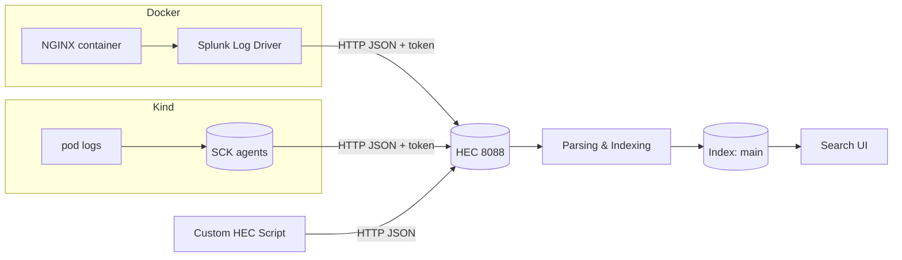
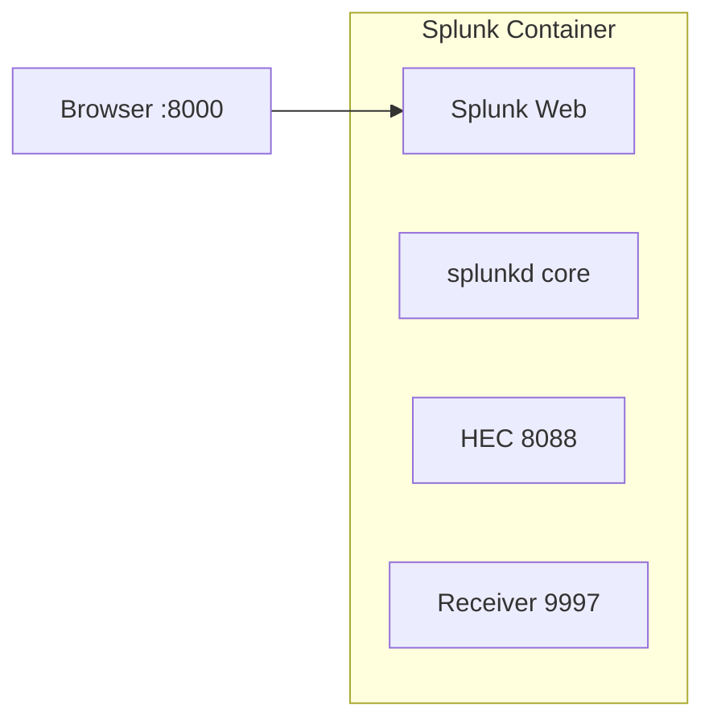
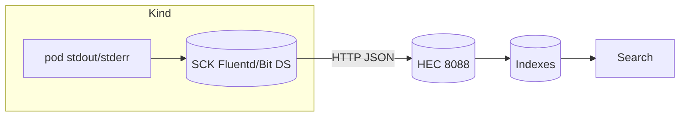

# Splunk Local Lab (Docker + Kind + ArgoCD)

Hands-on guide to run Splunk Enterprise locally with Docker, collect logs/metrics from containers and Kubernetes (Kind), and visualize in Splunk.

All commands target Windows PowerShell (v5.1+) with Docker Desktop running.

## What you’ll learn
- Spin up Splunk locally and understand core components (UI, HEC, receivers)
- Ingest Docker container logs using the Splunk logging driver
- Ingest Kubernetes logs/metrics from a local Kind cluster using SCK (Splunk Connect for Kubernetes)
- Send custom events through HEC and search them in Splunk

## Core Splunk Ingestion Concepts (Read First)
| Term | Description | Default Port | Protocol | Use When |
|------|-------------|--------------|----------|----------|
| HEC (HTTP Event Collector) | Token-authenticated REST endpoint `/services/collector` for JSON/text events | 8088 | HTTP/HTTPS | Cloud-native & app/direct pushes (Docker log driver, SCK, scripts) |
| Receiving Port (splunkd) | Listener for data forwarded by Splunk Forwarders | 9997 | Proprietary TCP | Standard enterprise forwarding, file tail via UF |
| Universal Forwarder (UF) | Lightweight agent that tails files & forwards to indexers | (outbound) | TCP | Server/file-based ingestion needing low footprint |
| Sourcetype | Label describing data format, drives field extraction | — | — | Set for consistent parsing & searches |
| Index | Logical storage namespace (buckets) | — | — | Segregate data, retention, security |

HEC vs Receiving (9997):
- HEC: Stateless HTTP + token; great for ephemeral containers, k8s, serverless.
- Receiving (9997): Expects managed streams from forwarders (reliable batching, ACKs).
- In this lab: We actually use HEC; 9997 is enabled just so you know where it lives.

Minimal HEC event JSON:
```
{
  "time": 1710000000,
  "host": "demo-host",
  "source": "docker:web",
  "sourcetype": "nginx:access",
  "event": { "msg": "hello" },
  "fields": { "env": "lab" }
}
```

High-level data paths (ASCII):
```
[Docker Container] -> (Docker Splunk Log Driver) -> HEC:8088 -> Parsing -> Index=main
[Kind Pods] -> (SCK Agents) -> HEC:8088 -> Parsing -> Index=main
[Custom Script] -> (HTTP POST JSON) -> HEC:8088 -> Parsing -> Index=main
```

Mermaid overview (optional rendering):


Best practice notes:
- Use separate indexes (docker, k8s_logs, app_events) in real environments.
- Assign meaningful sourcetypes (nginx:access, kube:container:stdout, app:demo) early.
- Separate HEC tokens per source for revocation & least privilege.

## Splunk UI Quick Orientation
- Apps menu → Search & Reporting: run SPL searches.
- Settings → Data Inputs → HTTP Event Collector: manage tokens & SSL.
- Settings → Indexes: create new logical storage targets.
- Settings → Forwarding and receiving: enable 9997 (forwarders).
- Activity → Indexing Volume: verify ingest volume when debugging.

---

## 1) Prepare folders and env

What/Why:
- Create a lab folder and an .env file to keep sensitive settings (passwords/tokens) out of compose files.

```
$root = "$PSScriptRoot"; if (-not $root) { $root = (Get-Location).Path }
$lab = Join-Path $root "splunk"
New-Item -ItemType Directory -Force -Path $lab | Out-Null
```

Create an `.env` file for Docker Compose (values are demo-only):
```
@"
SPLUNK_START_ARGS=--accept-license
SPLUNK_PASSWORD=Changeme123!
SPLUNK_HEC_TOKEN=00000000-0000-0000-0000-000000000000
SPLUNK_HEC_ENABLE=true
SPLUNK_HTTP_PORT=8000
SPLUNK_HEC_PORT=8088
"@ | Set-Content -Path (Join-Path $lab ".env")
```

How to verify:
- File exists at `<repo>/splunk/.env` and contains your values.

Expected result:
- A folder `splunk` in your repo root with `.env` inside.

Additional (optional): add `SPLUNK_HEC_SSL=false` in `.env` during local testing (NOT for prod) to simplify using plain http.

---

## 2) Docker Compose for Splunk

Concept diagram:


Roles:
- splunkd: parsing, indexing, search scheduling.
- Web: UI front-end.
- HEC: token-auth JSON ingest.
- Receiver 9997: forwarder ingestion (unused in lab but enabled).

Why named volumes: persist config (`etc`) & data (`var`) across container recreation.

HEC health check (after start):
```
curl -k https://localhost:8088/services/collector/health
```
Expect: `{"text":"HEC is healthy","code":17}` (or plain http if SSL disabled).

Create `docker-compose.yml`:
```
@"
version: '3.8'
services:
  splunk:
    image: splunk/splunk:9.2.1
    container_name: splunk
    ports:
      - "8000:8000"  # UI
      - "8088:8088"  # HEC
      - "9997:9997"  # Splunkd receiving
    environment:
      - SPLUNK_START_ARGS=${SPLUNK_START_ARGS}
      - SPLUNK_PASSWORD=${SPLUNK_PASSWORD}
      - SPLUNK_HEC_TOKEN=${SPLUNK_HEC_TOKEN}
      - SPLUNK_HEC_ENABLE=${SPLUNK_HEC_ENABLE}
      - SPLUNK_HTTP_PORT=${SPLUNK_HTTP_PORT}
      - SPLUNK_HEC_PORT=${SPLUNK_HEC_PORT}
    volumes:
      - splunk-var:/opt/splunk/var
      - splunk-etc:/opt/splunk/etc
volumes:
  splunk-var:
  splunk-etc:
"@ | Set-Content -Path (Join-Path $lab "docker-compose.yml")
```

Start Splunk:
```
docker compose -f "$lab/docker-compose.yml" --env-file "$lab/.env" up -d
```

How to verify:
- Watch logs: `docker logs -f splunk` until you see “Ansible playbook complete” or Splunk services started.
- Open http://localhost:8000 (user: admin, password: the one you set).
- In Splunk UI: Settings → Data Inputs → HTTP Event Collector → confirm HEC is enabled and a token exists.
- In Splunk UI: Settings → Forwarding and receiving → Configure receiving → make sure 9997 is enabled (add “9997” if not shown).

Expected result:
- Splunk UI reachable, HEC healthy, receiving port listening.

---

## 3) Collect Docker container logs

Goal: Demonstrate zero-agent container log streaming using Docker’s Splunk log driver.

Sequence:
```
Container stdout -> Docker logging subsystem -> Splunk log driver -> HEC POST -> Index
```
Key log driver options used:
- `splunk-token`: Auth for HEC.
- `splunk-url`: Endpoint (match http/https + port + host).
- `splunk-insecureskipverify`: Accept self-signed cert (local only).
- `splunk-format=raw`: Sends raw line (use `json` for structured payload wrapper).
Enhancements you can add:
- `--log-opt tag="{{.Name}}"`
- `--log-opt splunk-sourcetype=nginx:access`
- `--log-opt splunk-source=docker:nginx`
- `--log-opt splunk-index=docker` (if you create a docker index).

Latency test SPL once logs are flowing:
```
index=main tag=web | eval ingest_delay=_indextime-_time | stats avg(ingest_delay) max(ingest_delay)
```

Troubleshooting quick table:
| Symptom | Likely Cause | Fix |
|---------|--------------|-----|
| EOF / handshake error | Protocol mismatch (https vs http) | Align splunk-url with HEC SSL setting |
| No events | Wrong token or driver not attached | `docker inspect web` check LogConfig; verify token |
| sourcetype=httpevent only | Missing explicit sourcetype | Add `splunk-sourcetype=` option |

Run a sample container with Splunk log driver:
```
docker run -d --name web `
  --log-driver splunk `
  --log-opt splunk-token=00000000-0000-0000-0000-000000000000 `
  --log-opt splunk-url=http://host.docker.internal:8088 `
  --log-opt splunk-insecureskipverify=true `
  --log-opt splunk-format=raw `
  -p 8081:80 nginx
```

Compose example `docker-app-compose.yml` (ships logs from a containerized app to Splunk):
```
@"
services:
  web:
    image: nginx
    ports:
      - "8081:80"
    logging:
      driver: splunk
      options:
        splunk-token: ${SPLUNK_HEC_TOKEN}
        splunk-url: http://host.docker.internal:8088
        splunk-insecureskipverify: "true"
        splunk-format: raw
"@ | Set-Content -Path (Join-Path $lab "docker-app-compose.yml")
```

Start it:
```
docker compose -f "$lab/docker-app-compose.yml" --env-file "$lab/.env" up -d
```

How to test:
- Generate some logs by hitting NGINX:
```
for ($i=0; $i -lt 20; $i++) { Invoke-WebRequest -UseBasicParsing http://localhost:8081 | Out-Null }
```

What to search in Splunk:
- Search → `index=main source::docker container_name=web`
- Try: `index=main container_name=web | stats count by host, container_name`

Expected result:
- New events appear with host and container fields. You’ll see NGINX access logs coming from the `web` container.

---

## 4) Kind + Splunk Connect for Kubernetes (SCK)

Goal: Enrich logs with Kubernetes metadata (namespace, pod, container, node) via SCK agents.

Architecture:


Key Helm value mapping:
- `splunk.hec.host=host.docker.internal` ensures pods reach Splunk on host.
- `splunk.hec.token` must match `.env` token.
- Add `--set splunk.indexName=k8s_logs` (after creating that index) to separate data (optional improvement).

Useful searches:
```
index=main kubernetes.namespace_name=demo | stats count by kubernetes.pod_name
index=main kubernetes.namespace_name=demo ERROR OR WARN
index=main | stats count by sourcetype | sort - count
```

Troubleshooting:
| Issue | Check | Solution |
|-------|-------|----------|
| CreateContainerConfigError | `kubectl describe pod <pod-name>` | Check if HEC token secret exists and has data |
| No k8s logs | `kubectl -n kube-system logs ds/sck-splunk-kubernetes-logging` | Verify token is set correctly in Helm values |
| Token errors | Search `_internal` for `HttpInputDataHandler` | Ensure $hecToken variable is set before Helm install |
| Protocol errors in metrics | `kubectl logs <metrics-pod>` | Use global.splunk.hec.* for all settings |
| host.docker.internal unresolved | Use host machine IP or port-forward Splunk | Check Docker Desktop settings |

Common fixes:
```
# If pods are in CreateContainerConfigError, check secrets:
kubectl get secrets -n kube-system | findstr splunk
kubectl describe secret splunk-kubernetes-logging -n kube-system

# If secret is empty, re-run Helm with proper token:
$hecToken = "00000000-0000-0000-0000-000000000000"
helm upgrade sck splunk/splunk-connect-for-kubernetes -n kube-system [... same flags as above]
```

Install SCK Helm chart (unified chart). Set Splunk HEC variables to match `.env`:
```
$hecUrl = "http://host.docker.internal:8088"
$hecToken = "00000000-0000-0000-0000-000000000000"

helm repo add splunk https://splunk.github.io/splunk-connect-for-kubernetes/
helm repo update

# Check available charts
helm search repo splunk

# Install unified chart with logging and metrics enabled
# IMPORTANT: Ensure $hecToken is set before running this command
if (-not $hecToken) { 
  $hecToken = "00000000-0000-0000-0000-000000000000"
  Write-Host "Token set to: $hecToken"
}

helm upgrade --install sck splunk/splunk-connect-for-kubernetes `
  --namespace kube-system `
  --create-namespace `
  --set global.splunk.hec.host=host.docker.internal `
  --set global.splunk.hec.port=8088 `
  --set global.splunk.hec.protocol=http `
  --set global.splunk.hec.token=$hecToken `
  --set logging.enabled=true `
  --set metrics.enabled=true `
  --set objects.enabled=false
```

How to verify:
- `kubectl -n kube-system get pods | findstr sck`
- Ensure DaemonSets/Deployments are running.

Generate test workload:
```
kubectl create namespace demo
kubectl -n demo create deploy hello --image=nginx --replicas=2
kubectl -n demo expose deploy/hello --port 80 --type ClusterIP
kubectl -n demo get pods -o wide
```

What to search in Splunk:
- `index=main kubernetes.namespace_name=demo`
- `index=main kubernetes.pod_name=*hello* | stats count by kubernetes.pod_name, kubernetes.container_name`

Expected result:
- You’ll see logs with Kubernetes metadata fields (namespace, pod, node). Metrics index entries appear if metrics are enabled (depends on Splunk configuration). If you don’t see data, check HEC token and network path to host.docker.internal.

---

## 5) Send custom events via HEC

Goal: Directly push structured JSON with custom sourcetype & fields to build app-level observability.

Improved payload (with sourcetype & host):
```
$body = @{ 
  sourcetype = "app:demo"; host = "lab-host"; 
  event = @{ msg="hello splunk"; app="demo"; level="INFO"; trace_id=[guid]::NewGuid().ToString() } 
} | ConvertTo-Json -Compress
Invoke-RestMethod -Method Post -Uri "https://localhost:8088/services/collector" -Headers @{ Authorization = "Splunk 00000000-0000-0000-0000-000000000000" } -Body $body -ContentType 'application/json' -SkipCertificateCheck
```

Validation SPL:
```
index=main sourcetype=app:demo | stats count by level
index=main sourcetype=app:demo | eval ingest_delay=_indextime-_time | stats avg(ingest_delay)
```

Batching tip: send array under `{"events":[ {...},{...} ]}` for higher throughput.

What to search:
- `index=main app=demo msg="hello splunk"`

Expected result:
- A single event with fields `app=demo` and `msg=hello splunk`.

---

## 6) Clean up
```
docker compose -f "$lab/docker-compose.yml" down -v
if (Test-Path "$lab/docker-app-compose.yml") { docker compose -f "$lab/docker-app-compose.yml" down -v }
helm uninstall sck -n kube-system
kubectl delete ns demo
```

Expected result:
- Containers and volumes removed, SCK releases uninstalled, demo namespace deleted.

---

## Troubleshooting and tips
Extended internal diagnostics:
```
index=_internal source=*splunkd.log* HEC
```
Common performance optimizations (beyond lab):
- Create dedicated indexes & retention policies per data class.
- Use index-time filtering to drop noisy namespaces.
- Leverage props/transforms for sourcetype normalization.

Cheat Sheet Searches:
```
index=main | stats count by sourcetype | sort - count
index=main sourcetype=nginx:access | timechart span=1m count by status
index=main kubernetes.namespace_name=demo | stats dc(kubernetes.pod_name) as pods count by kubernetes.container_name
index=main sourcetype=app:demo | stats count by level
```
